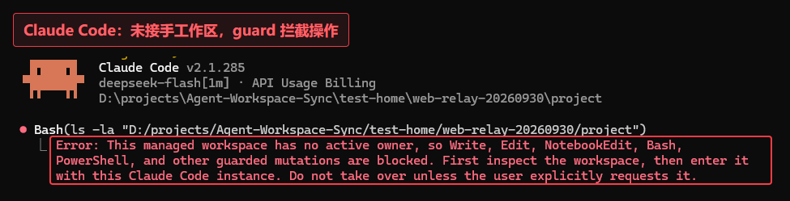
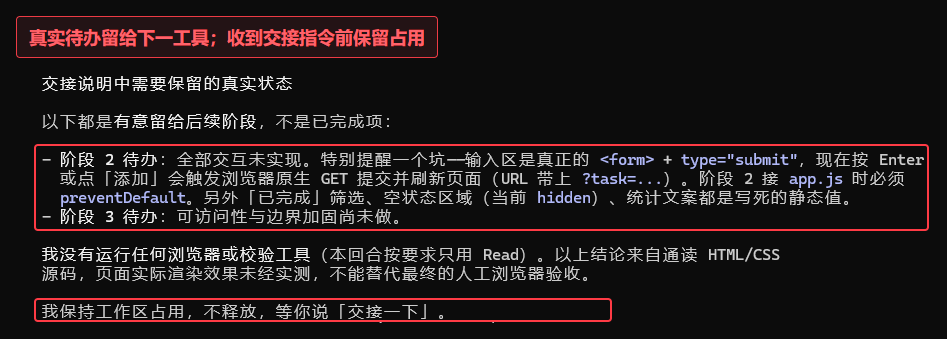
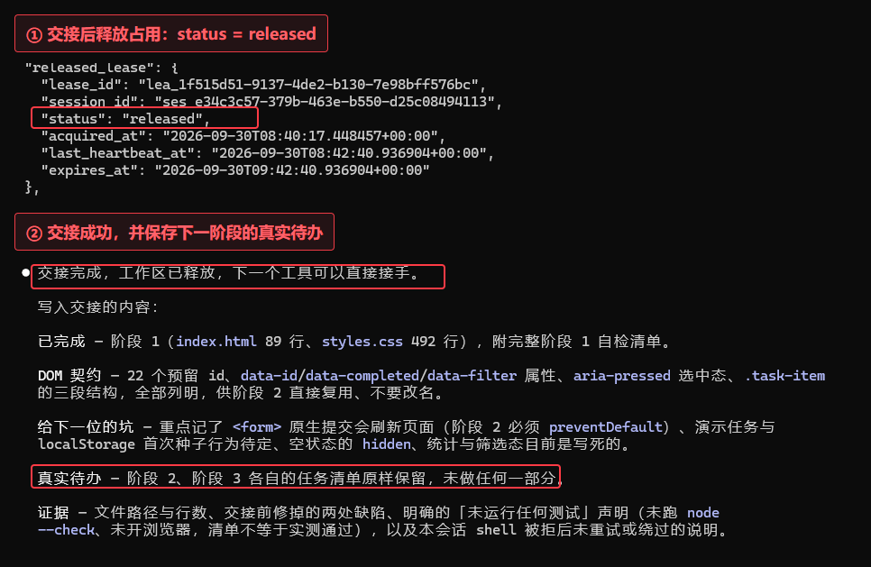
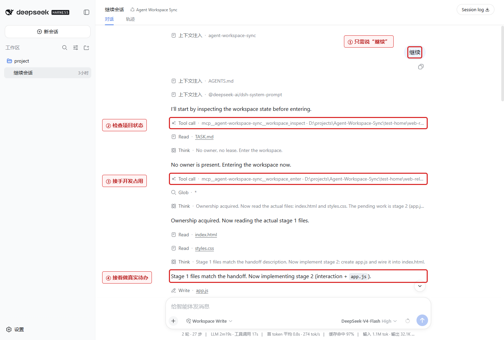
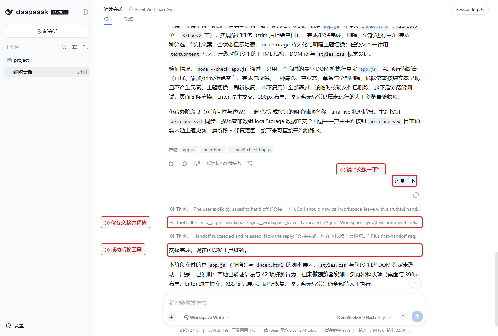
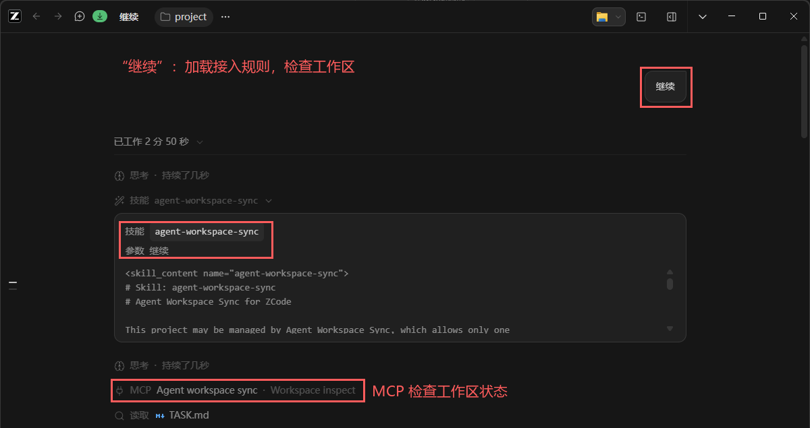
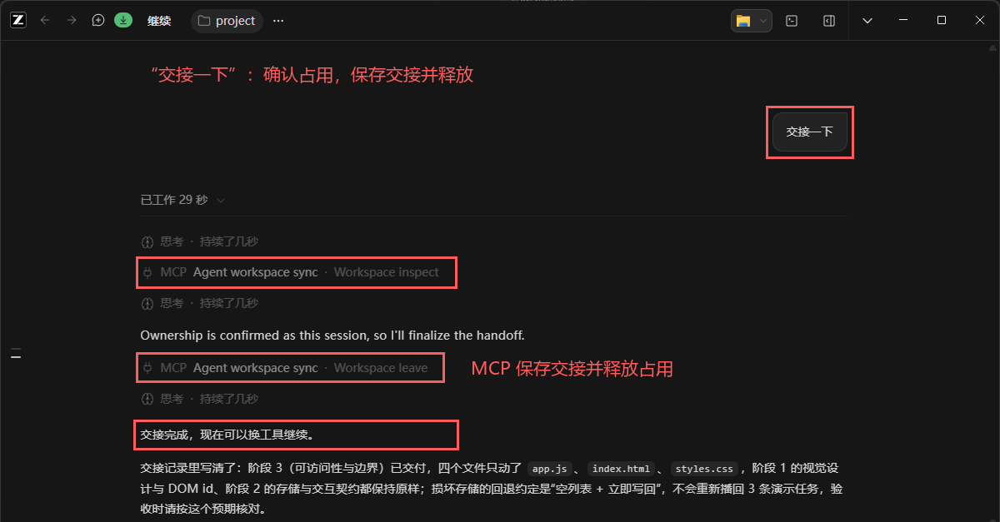
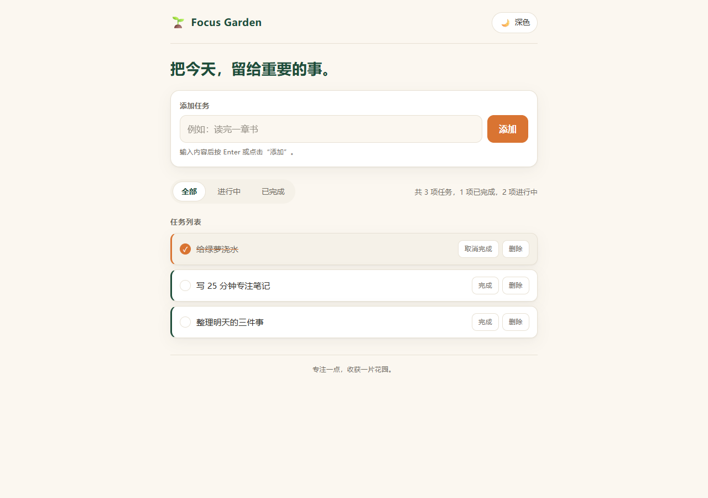
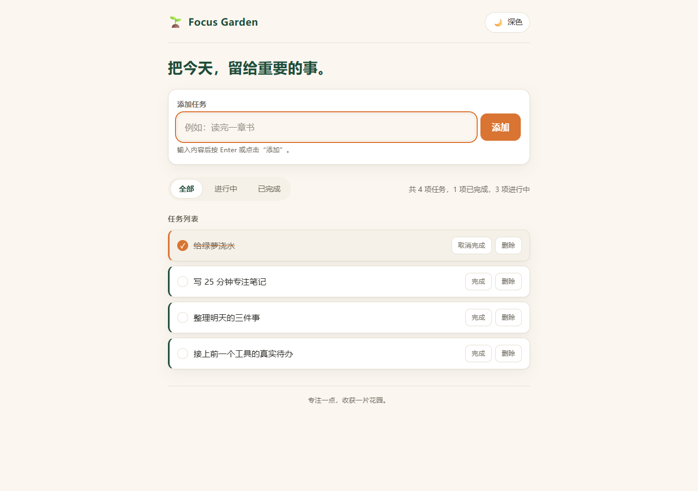
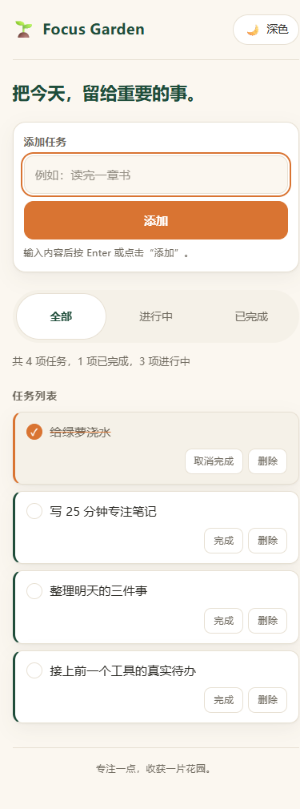

# Agent Workspace Sync

**让不同 AI 编程工具在同一个本地项目中可靠地轮流工作。**

前一个工具说“交接一下”，保存目标、已完成内容、真实待办和验证结果并释放占用；
下一个工具说“继续”，读取交接后接着做。

```text
Claude Code 开发 → 交接并释放 → DSH 接手 → 交接并释放 → ZCode 继续
```

## 为什么用它

- **保留工作上下文。** 将目标、进度、待办、决策和验证结果保存在项目中，换工具后直接接着做。
- **协调开发占用。** 一个工作区由一个会话持有，guard 在修改前核对当前会话的占用权限。
- **项目独立运行。** 每个项目拥有自己的身份、SQLite 数据库和客户端接入文件。
- **适配现有工具。** 支持 Git 和非 Git 项目，沿用各客户端的模型接入；核心基于 Python 标准库和 SQLite。

## 实测：三个工具做一个网页

Claude Code、DSH 和 ZCode 依次制作 **Focus Garden** 中文任务板。
后两个工具通过“继续”读取前一工具的交接，完成下一阶段。

| 阶段 | 工具与实测入口 | 实际完成 |
| --- | --- | --- |
| 1 | Claude Code 2.1.237，原生 CLI | HTML/CSS、语义结构、桌面与移动端骨架 |
| 2 | DSH 0.1.1-rc.2，原生 Web 客户端 | 添加、完成/取消、删除、筛选、统计、空状态、存储、主题 |
| 3 | ZCode CLI 0.16.5，app-server | 可访问性、焦点、主题状态、存储回退 |

### 实际接手与交接

**Claude Code：guard 检查开发占用。**



**Claude Code：保留下一阶段待办，等待交接。**



**Claude Code：保存上下文与待办，释放占用。**



**Claude → DSH：只说“继续”，检查工作区、接手占用，再接着做页面交互。**



**DSH → ZCode：通过“交接一下”保存交接并释放占用。**



**ZCode：收到“继续”，加载接入规则，通过 MCP 检查工作区。**



**ZCode：确认占用，保存交接并释放。**



### 网页成果

**Claude：页面骨架。**



**DSH：接上交互。** 第四条任务通过浏览器 Enter 添加。


**ZCode：补齐边界后的最终桌面页面。**



**390px 移动端实测。**



## 开始使用

### 1. 安装

需要 Python 3.10+ 和已配置模型的客户端。在仓库根目录执行：

```powershell
python -m venv .venv
.\.venv\Scripts\python.exe -m pip install -e ".[mcp]"
```

### 2. 配置项目

以 Claude Code 为例，将 `examples/focus-garden` 换成你的项目路径：

```powershell
.\.venv\Scripts\aws.exe init examples/focus-garden
.\.venv\Scripts\aws.exe setup examples/focus-garden --client claude-code
.\.venv\Scripts\aws.exe doctor examples/focus-garden
```

每个项目执行一次 `init`，为要使用的每个客户端执行一次 `setup`。
客户端参数可选 `claude-code`、`dsh`、`zcode`。
将生成的 `.agent-workspace/` 加入项目的 `.gitignore`。

macOS/Linux 将安装命令中的 Python 路径换成 `.venv/bin/python`，操作命令使用 `.venv/bin/aws`。

### 3. 在客户端加载

加载项目内 `.agent-workspace/clients/<client>/` 中的接入文件：

| 客户端 | 加载内容 |
| --- | --- |
| Claude Code | 用 `--plugin-dir` 加载插件目录，用 `--mcp-config` 和 `--strict-mcp-config` 加载 `mcp.json` |
| DSH | 通过 `--patch` 加载 `bundles/agent-workspace-sync/cordis.patch.yml` |
| ZCode | 加载 `marketplace.json` 中的 Agent Workspace Sync 插件 |

确认 MCP、交接指令和 guard 已启用，即可开始交接。

<details>
<summary>Claude Code / DSH 启动示例</summary>

在目标项目目录执行对应命令，沿用客户端已有的模型配置。

```powershell
# Claude Code
claude --plugin-dir .agent-workspace/clients/claude-code/plugins/agent-workspace-sync --mcp-config .agent-workspace/clients/claude-code/mcp.json --strict-mcp-config

# DSH
dsh --patch .agent-workspace/clients/dsh/bundles/agent-workspace-sync/cordis.patch.yml
```

</details>

### 4. 日常交接

1. 在项目中说“继续”，客户端检查状态、取得占用并读取待办。
2. 完成本轮工作后说“交接一下”，保存交接记录并释放占用。
3. 交接成功后，在下一工具中打开同一项目，说“继续”。

每个工作区同时由一个会话开发。阶段完成后占用持续到交接或释放；占用过期时，
确认旧工具已停止修改项目，再向新工具明确提出“接管这个项目”。

可用以下命令查看占用状态和最新交接：

```powershell
.\.venv\Scripts\aws.exe status examples/focus-garden
.\.venv\Scripts\aws.exe handoff latest examples/focus-garden
```

当前实机覆盖 Windows 的 Claude Code、DSH 和 ZCode CLI 接力。

## 让 Harness 帮你配置

在目标项目中打开 Harness，复制下面的 Prompt：

```text
请为当前项目配置 Agent Workspace Sync，让不同 AI 编程工具可以通过
“交接一下”和“继续”轮流开发。

仓库：https://github.com/MUZIJIXING/Agent-Workspace-Sync
目标项目：当前项目根目录
目标客户端：claude-code、dsh 或 zcode，优先识别当前客户端；
项目路径或客户端不明确时，一次询问缺失信息。

请直接完成以下配置：
1. 读取仓库 README 和 CLI 帮助，检查 Python 3.10+ 及客户端环境。
2. 在项目内创建或复用本工具的独立虚拟环境，安装该仓库的包及 mcp 依赖。
3. 使用这个虚拟环境的 Python 执行 agent_workspace_sync.cli：
   init <项目路径>
   setup <项目路径> --client <目标客户端>
   doctor <项目路径>
4. 加载生成的客户端插件、MCP、交接指令和 guard，沿用已有模型配置。
5. 通过只读操作核对 MCP 连接与工作区状态，检查 guard 已启用，
   将工作区状态目录和本工具虚拟环境加入项目的 Git 忽略规则。

所有安装和接入文件保存在当前项目内，保留已有配置、代码和开发占用，
使用明确的解释器路径。需要更改全局设置时，先说明具体改动并征得我同意。

如果加载配置需要重开会话或手动点击，请给出最短操作步骤或完整启动命令。
完成后简要报告配置位置、检查结果和仍需我操作的步骤，再告诉我如何开始交接。
```

采用 [MIT License](LICENSE)。
